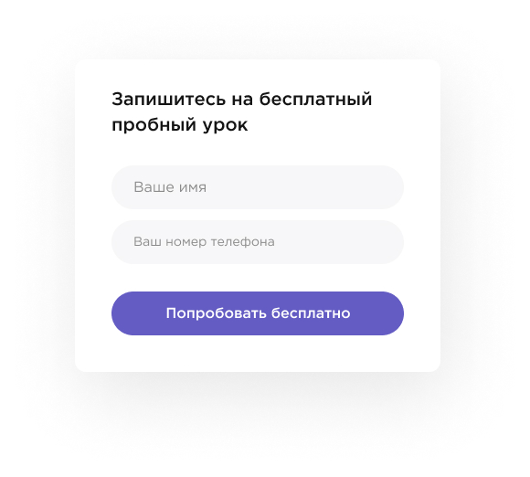
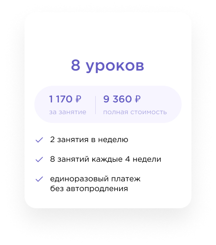
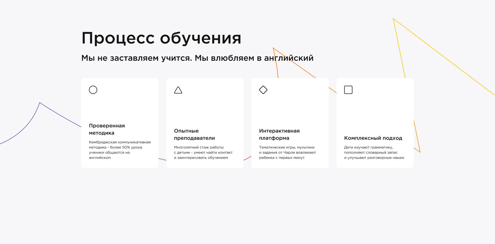

# semester-2
## lab 1 
### Task 1. human body 

```
.head .head__eye .head__eye--closed
.body .body__hand .body__hand--color_red
.hand .hand__finger .hand__finger--tiny
```

### Task 2. 

 
```
header.header>a.header__logo>img.header__logo-img^nav.header__nav>ul.nav__list>li.nav__item*5>a.nav__link^^ul.nav__list>li.nav__item*2>a.nav__link^^^button.header__button+button.header__reg-button
```
 
```
form.form>fieldset.form__block>legend.form__header+label.form__label+input.form__input+form__label+input.form__input+button.form__button-request
```

 
```
.program-prices__card>h2.card__heading+.card__prices>.card__one-price>p.one-price__money+p.one-price__text^.card__whole-price>p.whole-price__money+p.whole-price__text^^ul.card__lessons>li.lessons__info*3

```

 
```
section.learning-process>h2.learning-process__heading+h3.learning-process__text+div.learning-process__cards>(div.learning-process__card>img.card__icon+ul>li.card__heading+li.card__text)*4
```
            
